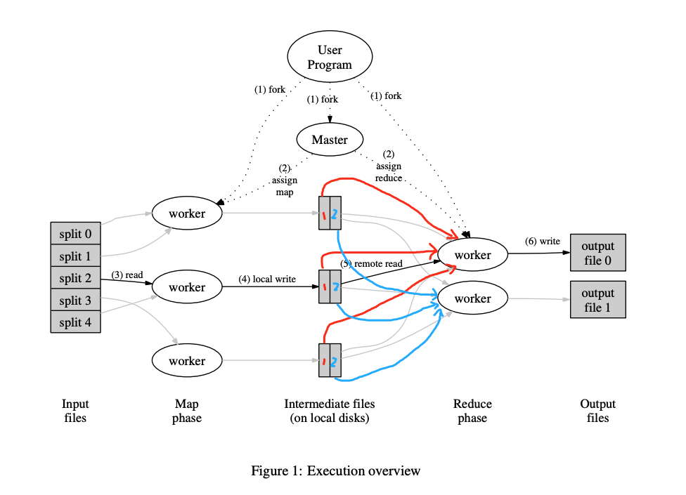
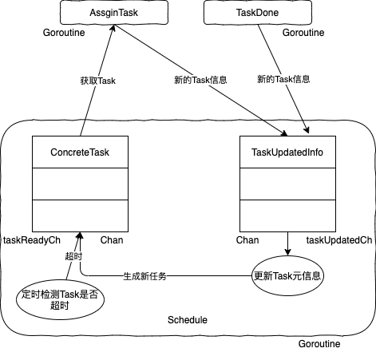

[toc]

# Lab 1: MapReduce

## 实验说明

***

在给定框架下，构建一个MapReduce系统。主要实现两块内容：

* **Coordinator**：向Worker分配Map或Reduce任务，需处理Worker宕机的情况。
* **Worker**：向Coordinator请求Map或Reduce任务，根据任务调用Map或Reduce函数进行数据处理。

## 实现思路

***

回顾[MapReduce](http://static.googleusercontent.com/media/research.google.com/en//archive/mapreduce-osdi04.pdf)的执行流程图，如下图：每个Input file通过带map任务的worker，将map结果输出成n个分区（图中为2份），其中n是reduce的任务数，也是最后Output files的数量。待map任务全部执行完毕后，带reduce任务的wroker去获取map结果生成Output file，每个reduce任务只处理同一分区的结果。值得注意：worker可执行map或reduce任务，所以不同worker可以算是对等的。reduce任务的分发，在下图我用不同颜色标识了一下，会好理解一些。



### 总体框架

第一版的实现比较直白，Worker通过rpc从Coordinator获取Task，Coordinator同时生成一个goroutine来监控Task是否执行超时。Worker获取Task的方式可以是遍历Coordinator中的Task信息，也可以通过一个channel获取。Worker获取到Task后进行map或reducer任务的处理，处理完毕后通过rpc告知Coordinator。Coordinator根据Worker的返回信息更新Task的状态。这样的实现能通过测试，但思考了一下还有几个可改进的地方：1.map和reduce任务很相似，实现的时候应该尽可能抽象出相同的部分。2.对于每个Task都需要额外生成一个goroutine来监控超时情况。倘若有上千个Task，就要生成上千个goroutine，这样会比较浪费资源。想了想，于是做了第二版实现。

第二版的实现框架如下图：Schedule是在Coordinator中的调度总控，这个goroutine里有两个channel：一个是存放具体Task的taskReadyCh，一个是存放Task更新信息的taskUpdatedCh。Worker通过AssginTask RPC从taskReadyChan获取Task，同时向taskUpdatedCh存入Task更改信息。Worker处理Task完毕后，也是通过TaskDone RPC存入Task更改信息。Schedule会从taskUpdatedCh取出更改信息更新Task，以便生成新的Task和监控Task执行情况。从图可看出，所有Task的生成、状态更新和超时监控都在Schedule这一个goroutine里进行，避免了用锁去控制对Task信息的访问，也减少了对资源的消耗。



### Coordinator实现

Coordinator结构体。结构体内存放的Tasks信息是TaskMetaData元信息，Schedule会根据元信息生成具体的ConcreteTask。这里将TaskMetaData和ConcreteTask分离，是因为TaskMetaData里可以统计每个Task的执行状况、生成时间或执行时长等信息，而这些信息其实没必要让worker知道，worker只需关注Task的具体内容。

```go
type Coordinator struct {
	// Your definitions here.
	nReduce     int
	nMap        int
	mapTasks    []TaskMetaData
	reduceTasks []TaskMetaData

	mapTasksDoneNum    int
	reduceTasksDoneNum int

	taskReadyCh    chan ConcreteTask
	taskUpdatedCh  chan TaskUpdatedInfo
	allTasksDoneCh chan bool
}

type TaskMetaData struct {
	TaskType   TaskType
	TaskStatus TaskStatus
	FileNames  []string
	StartTime  time.Time
}

type ConcreteTask struct {
	TaskType  TaskType
	FileNames []string
	NReduce   int
	TaskId    int
}

type WorkerUpdateTaskInfo struct {
	TaskType     TaskType
	TaskStatus   TaskStatus
	TaskId       int
	ResFileNames []string
}

type TaskUpdatedInfo struct {
	TaskInfo WorkerUpdateTaskInfo
	Time     time.Time
}
```

Schedule的实现，包含了生成ConcreteTask、更新Task元信息和监控已分发的Task。这里对Task的监控是通过定时遍历mapTasks数组或reduceTasks数组去发现是否执行完毕。若Task太多，这样遍历肯定会比较花时间，可以考虑使用时间堆来实现。

```go
func (c *Coordinator) Schedule() {
  // 初始时，mapTasks先放入taskReadyCh中
	for i, metaData := range c.mapTasks {
		c.taskReadyCh <- ConcreteTask{metaData.TaskType, metaData.FileNames, c.nReduce, i}
	}
  
	for {
		select {
		case updatedInfo := <-c.taskUpdatedCh:
			c.UpdateTask(updatedInfo)
			if c.mapTasksDoneNum == c.nMap && c.reduceTasksDoneNum == c.nReduce {
				close(c.allTasksDoneCh)
				return
			}
		default:
			time.Sleep(time.Millisecond * 200)
			c.CheckTaskTimeOut()
		}
	}
}
```

与Worker通信的两个RPC handler

```go
func (c *Coordinator) AssignTask(args *RequestForTaskArgs, reply *RequestForTaskReply) error {
	select {
	case task := <-c.taskReadyCh:
		reply.Task = task
		updatedInfo := WorkerUpdateTaskInfo{task.TaskType, Assigned, task.TaskId, []string{}}
		c.taskUpdatedCh <- TaskUpdatedInfo{updatedInfo, time.Now()}
		return nil
	case <-c.allTasksDoneCh:
		reply.Task = ConcreteTask{NoTask, []string{}, -1, -1}
		return nil
	default:
		reply.Task = ConcreteTask{WaitTask, []string{}, -1, -1}
		return nil
	}
}

func (c *Coordinator) TaskDone(args *SendTaskDoneArgs, reply *SendTaskDoneReply) error {
	c.taskUpdatedCh <- TaskUpdatedInfo{args.TaskInfo, time.Now()}
	reply.Msg = "ok"
	return nil
}
```

### Worker实现

Worker的实现就比较简单了，主要是请求task，处理task，返回结果。具体怎么调用mapf和reducef，参考``mrsequential.go``就可以了。

```go
func Worker(mapf func(string, string) []KeyValue,
	reducef func(string, []string) string) {

	// Your worker implementation here.
	for {
		err, reply := RequestForTask()
		if !err {
			//fmt.Printf("cannot connect to master...")
			return
		}
		switch reply.Task.TaskType {
		case MapTask:
			if ok, res := MapProcess(mapf, reply.Task); ok {
				SendTaskDone(SendTaskDoneArgs{res})
			}
		case ReduceTask:
			if ok, res := ReduceProcess(reducef, reply.Task); ok {
				SendTaskDone(SendTaskDoneArgs{res})
			}
		case WaitTask:
			time.Sleep(time.Second)
		case NoTask:
			return
		default:
		}

	}

}
```

## 其他

***

* 为了保证生成文件的原子性，可先将生成结果写入一个临时tmp文件，然后通过系统调用``os.Rename``来改名完成原子性替换。

## 小结

***

* 这是6.824的第一个实验，看完论文理解原理后去实现其实不难，主要熟悉一下go的语法特性，熟悉一下RPC框架的调用。
* 由于lab已经写好了测试用例，所以有什么新想法都可以直接尝试实现，然后运行测试脚本验证一下。我自己也是做了第一版和第二版的尝试。
* 由于源码不能公开，上述只放了部分核心代码。如需源码可以联系我，欢迎讨论。存储小白，也请多指教。

