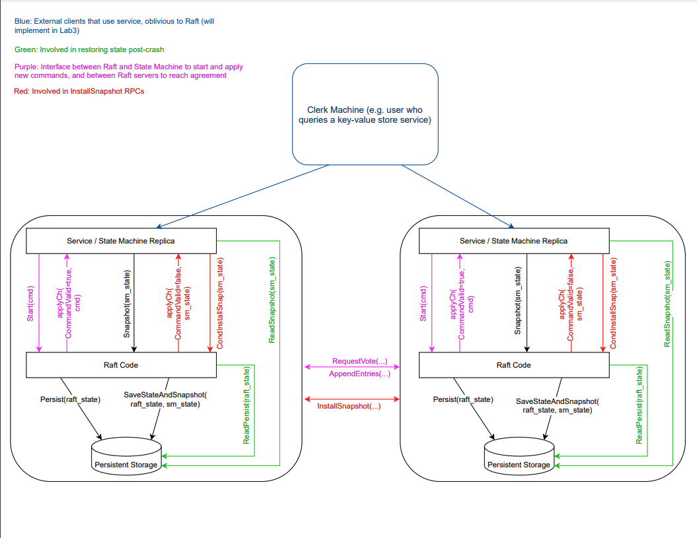
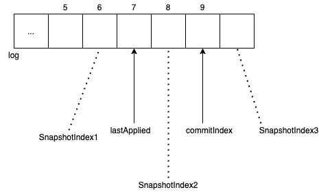

[toc]

# Lab2 Raft

## 实验说明

***

实现Raft一致性协议！

## 实现思路

***

先把论文看一遍，再把课程视频看一遍，再把lab里用到的参考资料看一遍，然后开搞，搞不对了再去看看官方的讲解，看看漏了哪些细节。我的实现参考了一些官方提供的做法，具体后面会讲，这里先放出官方的流程图。实现完后发现这张图其实讲得十分详细。整体实现大概分为四个部分：leader选举、日志复制、日志持久化和日志快照snapshot。



### leader election

选主的实现比较简单。这里实现了个定时器，定时去判断当前节点是否主，为主就发送心跳且重置选举时间；不为主且选举时间到了，就开始进行投票选举。

```go
func (rf *Raft) ticker() {
	for !rf.killed() {
		rf.tick()
		ms := 50
		time.Sleep(time.Duration(ms) * time.Millisecond)
	}
}

func (rf *Raft) tick() {
	rf.mu.Lock()
	defer rf.mu.Unlock()
  
	if rf.state == Leader {
		rf.setElectionTimeL()
		rf.sendAppendsL(true)
	}
	if time.Now().After(rf.electionTime) {
		rf.setElectionTimeL()
		rf.startElectionL()
	}
}
```

候选节点发送投票请求和从节点的请求处理。这里需注意候选节点处理请求返回内容时需丢弃过期Term的结果，后续其他的rpc请求也是需要丢弃过期Term的结果，不然会造成一些状态回退的bug。

```go
// 候选节点发送投票请求
func (rf *Raft) requestVote(peer int, args *RequestVoteArgs, votes *int) {
	var reply RequestVoteReply
	ok := rf.sendRequestVote(peer, args, &reply)
	if ok {
		rf.mu.Lock()
		defer rf.mu.Unlock()

		Debug(dTerm, "S%d: RequestVote reply from %v: %v", rf.me, peer, &reply)
		if reply.Term > rf.currentTerm {
			rf.newTermL(reply.Term)
		} else if rf.currentTerm == args.Term && reply.VoteGranted {
      			// 只处理当前Term与arg.Term相同的请求，丢弃过期Term的请求。
			*votes += 1
			if *votes > len(rf.peers)/2 && rf.state != Leader {
				rf.becomeLeaderL()
        			// true：发送HeartBeat
				rf.sendAppendsL(true)
			}
		}

	}
}

// 其他节点处理投票请求
func (rf *Raft) RequestVote(args *RequestVoteArgs, reply *RequestVoteReply) {
	// Your code here (2A, 2B).
	rf.mu.Lock()
	defer rf.mu.Unlock()

	if args.Term < rf.currentTerm {
		reply.Term, reply.VoteGranted = rf.currentTerm, false
		return
	}

	if args.Term > rf.currentTerm {
		rf.newTermL(args.Term)
	}
	
  	// 判断主节点的log是否为最新
	LastLogIndex := rf.log.lastindex()
	LastLogTerm := rf.log.entry(LastLogIndex).Term
	uptodate := (args.LastLogTerm == LastLogTerm && args.LastLogIndex >= LastLogIndex) ||
		args.LastLogTerm > LastLogTerm

	Debug(dVote, "S%d RequestVote %v %v uptodate %v (LastLogIndex %v, LastLogTerm %v)",
		rf.me, args, reply, uptodate, LastLogIndex, LastLogTerm)

	reply.Term = rf.currentTerm
	if (rf.votedFor == -1 || rf.votedFor == args.CandidateId) && uptodate {
		reply.VoteGranted = true
		rf.votedFor = args.CandidateId
    		rf.persist(false) // false: 不持久化snapshot
		rf.setElectionTimeL()
	} else {
		reply.VoteGranted = false
	}

}
```

### log

日志复制算是raft的核心，也是比较难的部分。首先要了解清楚论文图2中nextIndex[]、matchIndex[]、prevLogIndex、prevLogTerm变量的含义，然后根据论文图2尝试去实现。

首先是主节点发送日志复制请求或heatbeat请求。注意函数后带L都是在锁Lock下进行调用的。

```go
func (rf *Raft) sendAppendsL(heartBeat bool) {
	for i, _ := range rf.peers {
		if i != rf.me {
			if rf.log.lastindex() >= rf.nextIndex[i] || heartBeat {
				rf.sendAppendL(i, heartBeat)
			}
		}
	}
}

func (rf *Raft) sendAppendL(peer int, heartBeat bool) {
	next := rf.nextIndex[peer]
  
  	// 若leader安装了snapshot，会出现rf.log.start() > next的情况。
	if next <= rf.log.start() {
		next = rf.log.start() + 1
	}
  
  	// 当next的修改来自节点自身log长度时，是有可能大于rf.log.lastindex()的。
	if next > rf.log.lastindex()+1 {
		Debug(dInfo, "S%d: nextIndex[%v]=%v, startindex=%v, lastindex=%v",
			rf.me, peer, rf.nextIndex[peer], rf.log.start(), rf.log.lastindex())
		next = rf.log.lastindex() + 1
	}
  
	args := &AppendEntriesArgs{rf.currentTerm, rf.me, next - 1,
		rf.log.entry(next - 1).Term, make([]Entry, rf.log.lastindex()-next+1),
		rf.commitIndex}
  
	if len(args.Entries) != 0 {
   	// heartbeat请求中Entries可为空
		copy(args.Entries, rf.log.slice(next))
	}
  
	go func() {
		var reply AppendEntriesReply
		ok := rf.sendAppendEntries(peer, args, &reply)
		if ok {
			rf.mu.Lock()
			defer rf.mu.Unlock()
			rf.processAppendReplyL(peer, args, &reply)
		}
	}()
}
```

从节点处理日志复制请求，这里要几点要注意：

* 要思考当PrevLog与从节点当前log不同时（包括index或term的不同），如何向主节点同步信息，可使得主节点能迅速找到冲突日志，便于下次快速复制日志。我这里参考了2020课上老师的[做法](https://www.bilibili.com/video/BV1R7411t71W?p=7)，通过Xlen、XTerm和XIndex三个变量向主节点上报信息，具体情况见代码注释。
* 要思考将主的日志复制到本地日志时处理Term冲突的情况。

```go
func (rf *Raft) AppendEntries(args *AppendEntriesArgs, reply *AppendEntriesReply) {
	rf.mu.Lock()
	defer rf.mu.Unlock()
	Debug(dLog, "S%d AppendEntries args:%v", rf.me, args)

	reply.Success = false
	reply.Xlen = -1 // length of log
	reply.XTerm = -1 // term of conficting term
	reply.XIndex = -1 // index of first entry of Xterm

	if args.Term < rf.currentTerm {
		reply.Term, reply.Success = rf.currentTerm, false
		return
	}

	if args.Term > rf.currentTerm {
		rf.newTermL(args.Term)
	}

	rf.setElectionTimeL()

	reply.Term = rf.currentTerm
  
  	// PrevLogIndex与当前log长度不匹配时，更新当前log长度到Xlen
	if rf.log.lastindex() < args.PrevLogIndex || args.PrevLogIndex < rf.log.start() {
		Debug(dLog, "S%d PerLogIndex:%v not match, log startindex:%v lastindex:%v", rf.me, args.PrevLogIndex, rf.log.start(), rf.log.lastindex())
		reply.Success, reply.Xlen = false, rf.log.lastindex()+1
		return
	}

	// 向主节点上报信息，加速下次复制日志
	// 当PreLogTerm与当前日志的任期不匹配时，找出日志第一个不匹配任期的index
	if rf.log.entry(args.PrevLogIndex).Term != args.PrevLogTerm {
		reply.XTerm = rf.log.entry(args.PrevLogIndex).Term
		reply.XIndex = args.PrevLogIndex
		reply.Success = false
		for i := args.PrevLogIndex; i >= rf.log.start(); i-- {
			if rf.log.entry(i).Term != reply.XTerm {
				reply.XIndex = i + 1
				break
			}
		}
		return
	}

	// 更新本地日志
  	needPersist := false
	appendIndex := args.PrevLogIndex + 1
	for i, logEntry := range args.Entries {
		if appendIndex > rf.log.lastindex() {
			// 一次性复制剩下的Entries
			rf.log.appendmany(args.Entries[i:])
      			needPersist = true
			break
		} else if rf.log.entry(appendIndex).Term != logEntry.Term {
			// 日志任期不一致时，以主的为准，清除所有过期的Entry
			rf.log.cutend(appendIndex)
			rf.log.append(logEntry)
      			needPersist = true
		}
		appendIndex += 1
	}
  
	if needPersist {
		rf.persist(false)
	}
	
  	// 通知上层可以apply主节点已经commit的日志。
	if args.LeaderCommit > rf.commitIndex {
		rf.commitIndex = args.LeaderCommit
		if (rf.log.lastindex()) < rf.commitIndex {
			rf.commitIndex = rf.log.lastindex()
		}
		rf.signalApplierL()
	}
  
  	reply.Success = true 
}
```

主节点处理日志复制请求回复，同样需要抛弃过期term请求。这里也有几点要注意：

* 相同term的请求有可能因超时发送多次，所以要处理收到重复请求的情况，详细看注释。
* 当发现``rf.nextIndex[peer]``小于当前log长度时，说明主节点安装了snapshot，但从节点还没更新，所以需要向从节点发送snapshot。snapshot的实现后续会讲。

另外还有几点操作可以加速日志同步：

* 获取了从节点新的nextIndex后，立即重发日志同步请求。
* 给从节点发送完snapshot后，立即重发日志同步请求。

```go
func (rf *Raft) processAppendReplyL(peer int, args *AppendEntriesArgs,
	reply *AppendEntriesReply) {
  	Debug(dInfo, "S%d: processAppendReply from %v %v args: %v", rf.me, peer, reply, args)
	if reply.Term > rf.currentTerm {
		rf.newTermL(reply.Term)
	} else if rf.currentTerm == args.Term {
		rf.concreteProcessAppendReplyL(peer, args, reply)
	}
}

func (rf *Raft) concreteProcessAppendReplyL(peer int, args *AppendEntriesArgs, reply *AppendEntriesReply) {
	if reply.Success {
    		Debug(dInfo, "S%d: processAppendReply success: peer %v next %v match %v commitIndex:%v",
			rf.me, peer, rf.nextIndex[peer], rf.matchIndex[peer], rf.commitIndex)
    
		newnext := args.PrevLogIndex + len(args.Entries) + 1
		newmatch := args.PrevLogIndex + len(args.Entries)

		if newnext > rf.nextIndex[peer] {
			rf.nextIndex[peer] = newnext
		}
		if newmatch > rf.matchIndex[peer] {
			rf.matchIndex[peer] = newmatch
		}
    		if newmatch > rf.commitIndex {
			rf.advanceCommitL()
		}
	} else {
    
    		// 收到了重复且过期的请求，无需处理。
		if args.PrevLogIndex+1 != rf.nextIndex[peer] && args.PrevLogIndex != rf.log.start() {
			Debug(dInfo, "S%d: processAppendReply duplicated: args.PervLogIndex+1=%v rf.nextIndex[%v]=%v",
				rf.me, args.PrevLogIndex+1, peer, rf.nextIndex[peer])
			return
		}
    
		if reply.Xlen != -1 {
     			 // 若Xlen返回有值，通过Xlen更新nextIndex
			rf.nextIndex[peer] = reply.Xlen
		} else {
			// 默认使用XIndex作为nextIndex
			rf.nextIndex[peer] = reply.XIndex
			for i := args.PrevLogIndex; i >= rf.log.start(); i-- {
				if rf.log.entry(i).Term == reply.XTerm {
					// 若找到最后一个与XTerm相同的i，使用i+1作为nextIndex
					Debug(dInfo, "S%d foundXTerm %v %v", rf.me, i, reply.XTerm)
					rf.nextIndex[peer] = i + 1
					break
				}
				if rf.log.entry(i).Term < reply.XTerm {
					// 若找不到，使用默认XIndex
					break
				}
			}
		}

		if rf.nextIndex[peer] < rf.log.start()+1 {
      			// 需发送snapshot
			args := &InstallSnapshotArgs{rf.currentTerm, rf.me, rf.snapshotIndex,
				rf.snapshotTerm, make([]byte, len(rf.snapshot))}
			copy(args.Data, rf.snapshot)
			go rf.sendSnapshot(peer, args， true) // true：发完snapshot后重新发送日志复制请求。
    		} else {
      			// 重新发送日志复制请求。
      			rf.sendAppendL(peer, false)
    		}
	}

}
```

最后是主节点的日志确认提交和所有节点的日志上报上层应用，这里有几点值得注意：

* 日志确认提交要从当前任期的日志开始确认，这个当时我看论文没思考清楚，调试了很久很久。
* 日志上报上层应用是用一个单独的goroutine去异步执行，可以上报snapshot和提交日志。

```go
// 主节点日志确认提交
func (rf *Raft) advanceCommitL() {
	if rf.state != Leader {
		Debug(dError, "S%d ErrorCommit: state:%v", rf.me, rf.state)
    		return
	}

	start := rf.commitIndex + 1
	if start < rf.log.start() {
		start = rf.log.start() + 1
	}

	for index := start; index <= rf.log.lastindex(); index++ {
		if rf.log.entry(index).Term != rf.currentTerm {
			continue // 5.4 important, 从当前任期的日志开始commit
		}
		n := 1
		for i := 0; i < len(rf.peers); i++ {
			if i != rf.me && rf.matchIndex[i] >= index {
				n += 1
			}
		}
		if n > len(rf.peers)/2 {
			Debug(dCommit, "S%d: Commit %v", rf.me, index)
			rf.commitIndex = index
		}
	}
	rf.signalApplierL()
}

// 日志上报上层应用
func (rf *Raft) applier() {
	rf.mu.Lock()
	defer rf.mu.Unlock()

	rf.lastApplied = 0
	if rf.lastApplied+1 <= rf.log.start() {
		// restart from a snapshot
		rf.lastApplied = rf.log.start()
	}

	for !rf.killed() {
		if rf.waitingSnapshot != nil {
			am := ApplyMsg{}
			Debug(dInfo, "S%d deliver snapshot", rf.me)
			am.SnapshotValid = true
			am.Snapshot = rf.waitingSnapshot
			am.SnapshotIndex = rf.waitingIndex
			am.SnapshotTerm = rf.waitingTerm
			rf.waitingSnapshot = nil

			rf.mu.Unlock()
			rf.applyCh <- am
			rf.mu.Lock()
		} else if rf.lastApplied+1 <= rf.commitIndex && rf.lastApplied+1 <= rf.log.lastindex() && rf.lastApplied+1 > rf.log.start() {
			rf.lastApplied += 1
			am := ApplyMsg{}
			am.CommandValid = true
			am.CommandIndex = rf.lastApplied
			am.Command = rf.log.entry(rf.lastApplied).Command
			Debug(dInfo, "S%d: deliver Command%v", rf.me, am.CommandIndex)
			rf.mu.Unlock()
			rf.applyCh <- am
			rf.mu.Lock()
		} else {
			rf.applyCond.Wait()
		}
	}
}
```

### persistence

持久化的实现比较简单。根据论文图2可知，currentTerm、votedFor和log[]这几个变量是需要持久化的，所以当这些变量发生变化时，调用一下``rf.persist()``函数进行持久化即可。不过实现了快照snapshot后，还需要持久化snapshotIndex、snapshotTerm和snapshot这几个变量。（突然发现snapshotTerm其实不需要持久化）。由于后面的lab是在当前raft的基础上进行实现，当时实现最后一个lab时发现我跑的时间比官方提供的结果长一点，所以作了一些优化，其中一点就是persist时加入了一个标志位，非必要的时候不会持久化snapshot。

```go
func (rf *Raft) persist(persistSnapshot bool) {
	// Your code here (2C).
	// Example:
	// w := new(bytes.Buffer)
	// e := labgob.NewEncoder(w)
	// e.Encode(rf.xxx)
	// e.Encode(rf.yyy)
	// data := w.Bytes()
	// rf.persister.SaveRaftState(data)
	w := new(bytes.Buffer)
	e := labgob.NewEncoder(w)
	e.Encode(rf.currentTerm)
	e.Encode(rf.votedFor)
	e.Encode(rf.log)
	e.Encode(rf.snapshotIndex)
	e.Encode(rf.snapshotTerm)
	data := w.Bytes()
	if persistSnapshot {
		rf.persister.SaveStateAndSnapshot(data, rf.snapshot)
	} else {
		rf.persister.SaveRaftState(data)
	}
}
```

### log compaction

要实现日志压缩其实就是snapshot，首先要理解与snapshot相关函数的调用关系，可对照官方流程图来理解：

* 上层应用保存好数据后，会调用``rf.Snapshot()``进行raft日志压缩，如果是主节点，同步压缩请求给从节点。这样的方式可认为是主动式日志压缩。
* raft节点不仅会收到上层的压缩请求，还可能会收到其他raft节点的压缩请求。当raft收到其他节点的压缩请求后，先把请求上报给上层应用，然后上层应用调用``rf.CondInstallSnapshot()``来决定是否安装快照。这样的方式可认为是被动式日志压缩。

理解了函数的调用关系后，可知主动式日志压缩其实较好实现，被动式就要考虑传来的压缩请求与节点本地已有日志的关系。其实也不复杂，基本是以下三种情况，对于收到小于本地lastApplied的SnapShot情况，其实不用处理即可，可以减少做snapshot的开销。这也是我优化时间的一点修改，具体处理方式可看代码。



主动式日志压缩实现，包括清空过期日志和同步最新快照给从节点。

```go
func (rf *Raft) Snapshot(index int, snapshot []byte) {
	// Your code here (2D).
	rf.mu.Lock()
	defer rf.mu.Unlock()

	if index > rf.snapshotIndex {
		rf.snapshot = snapshot
		rf.snapshotIndex = index
		rf.snapshotTerm = rf.log.entry(index).Term
		Debug(dInfo, "S%d snpatshot index:%v log startindex:%v lastindex:%v", rf.me, index, rf.log.start(), rf.log.lastindex())
    		// 清空过期日志
		rf.log.cutstart(index - rf.log.start())
		rf.persist(true)
		
    		// 主节点同步最新快照给从节点
		if rf.state == Leader {
			args := &InstallSnapshotArgs{rf.currentTerm, rf.me, rf.snapshotIndex,
				rf.snapshotTerm, make([]byte, len(rf.snapshot))}
			copy(args.Data, rf.snapshot)
			for i, _ := range rf.peers {
				if i != rf.me {
					go rf.sendSnapshot(i, args, false)
				}
			}
		}
	}
}
```

被动式日志压缩实现

```go
// 从节点收到压缩请求后的处理，先上报信息给上层应用
func (rf *Raft) InstallSnapshot(args *InstallSnapshotArgs, reply *InstallSnapshotReply) {
	rf.mu.Lock()
	defer rf.mu.Unlock()

	if args.Term < rf.currentTerm {
		reply.Term = rf.currentTerm
		return
	}
 	 Debug(dSnap, "S%d InstallSnapshot args: %v", rf.me, args)
  
	if args.Term > rf.currentTerm {
		rf.newTermL(args.Term)
	}
	rf.setElectionTimeL()

	reply.Term = rf.currentTerm
	if args.LastIncludedIndex > rf.lastApplied && args.LastIncludedIndex > rf.snapshotIndex && rf.waitingSnapshot == nil {
		rf.waitingSnapshot = args.Data
		rf.waitingIndex = args.LastIncludedIndex
		rf.waitingTerm = args.LastIncludedTerm
		rf.signalApplierL()
	}
}

// 上层应用调用该函数，根据该函数的返回值决定上层是否应用snapshot。
func (rf *Raft) CondInstallSnapshot(lastIncludedTerm int, lastIncludedIndex int, snapshot []byte) bool {

	// Your code here (2D).
	rf.mu.Lock()
	defer rf.mu.Unlock()
	
	if lastIncludedIndex > rf.snapshotIndex && lastIncludedIndex > rf.lastApplied {
		Debug(dSnap, "S%d condinstallsnapshot: index %v term %v", rf.me, lastIncludedIndex, lastIncludedTerm)
		if lastIncludedIndex >= rf.log.lastindex() || lastIncludedTerm != rf.log.entry(lastIncludedIndex).Term {
      		// 1.当lastIncludedIndex >= rf.log.lastindex()，相当于上图SnapshotIndex3的情况，清空所有日志
     		// 2.节点当前日志任期不匹配，也是直接清空
			rf.log = mkLog(make([]Entry, 1), lastIncludedIndex)  // dummy entry
			rf.log.entry(lastIncludedIndex).Term = lastIncludedTerm
		} else {
			// 清空过期日志，保留后续的内容
			rf.log.cutstart(lastIncludedIndex - rf.log.start())
		}
		rf.snapshotIndex = lastIncludedIndex
		rf.snapshotTerm = lastIncludedTerm
		rf.snapshot = snapshot
		rf.persist(true)
   	
    		rf.lastApplied = lastIncludedIndex
		if lastIncludedIndex > rf.commitIndex {
			rf.commitIndex = lastIncludedIndex
		}
		Debug(dSnap, "S%d condinstallsnpasot_res: log start: %v item: %v lastindex: %v", rf.me, rf.log.start(), rf.log.entry(rf.log.start()), rf.log.lastindex())
		return true
	} else {
		return false
	}
}
```

## 其他

***

上述分析几乎涵盖了整个raft的核心实现，还有一些地方可注意：

* 引入Snapshot后，log的起始坐标和长度都可能随时发生改变，为了方便获取log的信息，可额外写个log类来支持对应操作，这里我参考了2021课程里[Lab2讲解](https://www.bilibili.com/video/BV16f4y1z7kn?p=8)的做法。

  * ```go
    type Log struct {
    	Ilog   []Entry
    	Index0 int
    }
    
    func mkLogEmpty() Log {
    	return Log{make([]Entry, 1), 0}
    }
    
    func mkLog(log []Entry, index0 int) Log {
    	return Log{log, index0}
    }
    
    func (l *Log) append(e Entry) {
    	l.Ilog = append(l.Ilog, e)
    }
    
    func (l *Log) appendmany(e []Entry) {
    	l.Ilog = append(l.Ilog, e...)
    }
    
    func (l *Log) start() int {
    	return l.Index0
    }
    
    func (l *Log) lastindex() int {
    	return l.Index0 + len(l.Ilog) - 1
    }
    
    // ....
  
* 整体实现涉及模块较多，可分成多个文件来编写各模块的内容。

* 当从节点收到来自主节点的选举投票请求和日志复制请求时，要确认好返回true时的条件是否正确。当时有个bug困扰了我很久，最后发现是在日志复制请求中，一些边界条件没想清楚，直接返回了true，最终造成了日志不同步的现象。所以一定要确认好返回true时的情况。

* Debug一般就靠打日志了，打日志可打出当前节点的编号和状态（是否为主），方便调试。

## 小结

***

* 相对于2020版的课程，2021版新增了对lab2的[讲解](https://www.bilibili.com/video/BV16f4y1z7kn?p=8)，我上述实现参考了官方讲解的一些做法。我第一次实现的时候看的是2020版课程，写完后偶尔出现了日志不同步的bug，排查了比较久。后面出了2021年的课程，发现有官方讲解，就参考着一步一步实现，看哪里的细节自己遗漏了，最后发现是**日志确认提交要从当前任期的日志开始确认**这个重要的条件没考虑上，还是自己没思考清楚啊！当然自己根据调试，后面还加了很多边界条件的处理。
* 有一些bug要并行跑多次实验才能复现。自己一开始单核测了100次没问题以为就过了，很开心，然后开并行测试就挂壁了。因为当CPU跑满后，很多请求会由于调度不及时出现更多超时重试等情况。而且有些bug可能要并行测试几百次才会出现1次，所以每次测试尽量打好日志。大多发现的bug我都写在了上述代码的注释上，可供参考。虽然自己最后的实现并行跑了几百次没问题，但也不保证真的没有bug，欢迎指教！
* 后续的lab3和lab4都是在基于这个raft实现的，所以做这个lab时要尽可能保证正确。不然debug的时候很难发现是raft的问题还是上层实现的问题。
* 做完这个实验，加深了对raft一致性协议的理解。但上述实现还有很多可优化的地方，如Lease Read、日志复制pipeline等。可参考清华大佬的[实现](https://github.com/LebronAl/MIT6.824-2021/blob/master/docs/lab2.md)，里面很多丰富的资料帮助优化。
* 由于源码不能公开，上述只放了部分核心代码。如需源码可以联系我，欢迎讨论。存储小白，也请多指教。
