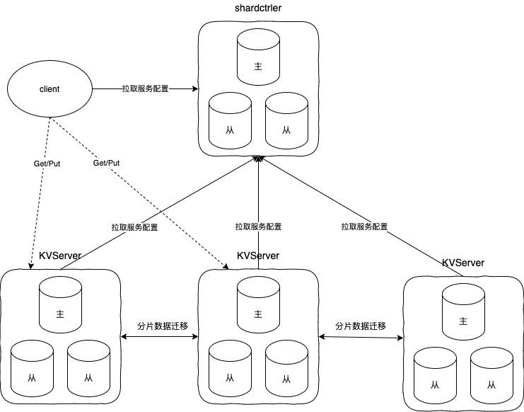
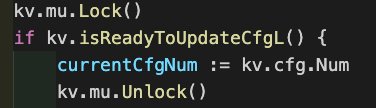
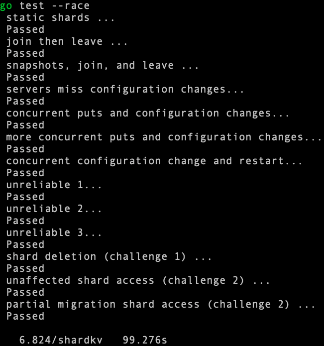

# Lab4 Sharded Key/Value Service

## 实验说明

***

构建一个支持Key分片的存储系统。系统由多个raft组构成，不同raft组服务不同分片。分片会在raft组间动态迁移，实现需满足分片能正确迁移且正常提供服务。

## 实现思路

***

### 整体框架

lab本身已经搭好了一个框架，有以下几个部分：

* ShardCtrler：负责管理集群配置，其中记录了每组ShardKVServer的集群信息和每个分片服务于哪组ShardKVServer。ShardCtrler也是由多个raft节点组成，所以是一个高可用的服务。
* ShardKVServer：相比lab3的KVServer，新增了几个功能：1.要定时从ShardCtrler上拉取最新配置信息，只服务属于本集群的Key请求，拒绝服务属于其他集群的Key请求。2.支持配置更新，即当配置发生变化时，若不再属于本集群的Key，需要清除内容，回收空间。3.新增属于本集群的Key，需要从其他集群拉取该Key的内容，当拉取完毕后再对外提供正常服务。
* Client：客户端定时从ShardCtrler上拉取最新配置信息，然后将Get/PutAppend请求分发到对应的ShardKVServer集群上。

调用流程图如下：



### Client

Client端的实现没什么特别，与lab3的差不多，只是注意当请求返回为ErrWrongGroup时，客户端要先从ShardCtrler拉取最新集群配置，然后再向新集群重试请求。

### ShardCtrler

ShardCtrler对外提供了Query、Join、Leave和Move四个接口。其中Join、Leave和Move会动态调整集群，使得分片信息发生变化。ShardCtrler整体实现过程与lab3的KVServer类似，首先看看结构体，由于Query操作支持查询特定编号的配置，所以需用数组保存历史配置信息。

```go
type ShardCtrler struct {
	mu      sync.Mutex
	me      int
	rf      *raft.Raft
	applyCh chan raft.ApplyMsg

	// Your data here.
	seqMap   map[int64]int64              // (clientId, 最后的seqId)
	indexMap map[IndexAndTerm]chan CommandResponse // (commitIndex+term, chan)
	configs  []Config                     
	dead     int32
}
```

接着讨论下Join、Leave和Move三个操作，这三种操作都是会更改配置的：

1. Move操作是强制使某个ShardKVServer集群服务某个分片，所以直接更改配置即可。
2. Join和Leave操作是添加或删除集群。由于lab要求分片服务均衡，即每个集群服务的分片数量应该差不多，所以当集群数发生变化时，需要一定方法来保证分片服务均衡。常用的负载均衡方法有一致性哈希算法，但由于该lab的分片数量只有10个，我这里采用了较为朴素的方式实现负载均衡，思路如下：集群数量发生变化后，先算出平均每个集群应该服务多少个分片，然后遍历现有的配置，对现有集群的分片进行多退少补的操作，具体可看代码的实现。

```go
// Join、Leave和Move操作会更改配置
func (sc *ShardCtrler) UpdateConfigL(opType string, args interface{}) Config {

	lastCfg := sc.configs[len(sc.configs)-1]

	// 复制上一个配置
	nextCfg := lastCfg
	nextCfg.Num += 1
	nextCfg.Groups = make(map[int][]string)
	for gid, servers := range lastCfg.Groups {
		nextCfg.Groups[gid] = append([]string{}, servers...)
	}
	DPrintf("SerNum: %v, opType: %v ", sc.me, opType)
	if opType == "Join" {
		joinArgs := args.(JoinArgs)
		sc.JoinReblance(&nextCfg, joinArgs.Servers)
	} else if opType == "Leave" {
		leaveArgs := args.(LeaveArgs)
		sc.LeaveReblance(&nextCfg, leaveArgs.GIDs)
	} else if opType == "Move" {
		moveArgs := args.(MoveArgs)
		if _, ok := nextCfg.Groups[moveArgs.GID]; ok {
			nextCfg.Shards[moveArgs.Shard] = moveArgs.GID
		}
	} else {
		DPrintf("error opType %v", opType)
	}
	DPrintf("updatCfg shardCtrler: %v: Op: %v nextCfg: %v lastCfg:%v", sc.me, opType, nextCfg, sc.configs[len(sc.configs)-1])
	sc.configs = append(sc.configs, nextCfg)
	return nextCfg
}

// Leave负载均衡
func (sc *ShardCtrler) LeaveReblance(config *Config, GIDs []int) {
	newSerNum := len(config.Groups)
	for _, gid := range GIDs {
		if _, ok := config.Groups[gid]; ok {
			delete(config.Groups, gid)
			newSerNum -= 1
		}
	}

	if newSerNum == 0 {
		config.Shards = [NShards]int{}
		config.Groups = map[int][]string{}
		return
	}
	sc.CommonReblance(config, newSerNum)
}

// Join负载均衡
func (sc *ShardCtrler) JoinReblance(config *Config, joinServers map[int][]string) {
	newSerNum := len(config.Groups)
	for gid, servers := range joinServers {
		if _, ok := config.Groups[gid]; !ok {
			newSerNum += 1
		}
		newServers := make([]string, len(servers))
		copy(newServers, servers)
		config.Groups[gid] = newServers
	}

	if newSerNum == 0 {
		return
	}
	sc.CommonReblance(config, newSerNum)
}

// 通过均衡算法
func (sc *ShardCtrler) CommonReblance(config *Config, newSerNum int) {
	bufferShards := []int{}       // 有哪些分片Shard分配不均匀的，放入buffer等待分配
	gidBuckets := map[int][]int{} // 统计目前每个gid集群服务哪些Shard

	avgNum := NShards / newSerNum

	// 新配置有哪些gid
	for gid := range config.Groups {
		gidBuckets[gid] = []int{}
	}

	// config.Shards是上一个配置的Shards
	for shard, gid := range config.Shards {
		if shardList, ok := gidBuckets[gid]; !ok {
			// 若上一个配置的分片Shard的gid不在新配置的Groups中，
			// 说明该分片要重新分配，把分片放入bufferShards
			bufferShards = append(bufferShards, shard)
			continue
		} else {
			if len(shardList) >= avgNum {
				// 如果新配置中，该gid服务的分片已大于平均值，则把该分片放入buffer
				bufferShards = append(bufferShards, shard)
			} else {
				gidBuckets[gid] = append(gidBuckets[gid], shard)
			}
		}
	}

	// 排序，保证每个raft节点都是相同的顺序更改配置
	var keys []int
	for k := range gidBuckets {
		keys = append(keys, k)
	}
	sort.Ints(keys)

	bufferShardsIndex := 0
	for _, k := range keys {
		shardList := gidBuckets[k]
		// 新配中的gid服务分片少于平均值的，加入buffer中的分片
		if len(shardList) < avgNum {
			for i := 0; i < avgNum-len(shardList) && bufferShardsIndex < len(bufferShards); i++ {
				config.Shards[bufferShards[bufferShardsIndex]] = k
				bufferShardsIndex += 1
			}
		}
	}
	// buffer还有剩余分片，并且该分片原gid不在新配置汇总，则分给其他新gid
	for i := bufferShardsIndex; i < len(bufferShards); i++ {
		if _, ok := config.Groups[config.Shards[bufferShards[i]]]; !ok {
			config.Shards[bufferShards[i]] = keys[0]
		}
	}
}
```

再看看Query的操作，由于ShardCtrler包含了历史配置信息，所以当查询已有配置时，可以直接返回，不需要生成raft日志进行请求同步，这样可以加快查询速度，具体参考了这篇[博客](https://www.jianshu.com/p/f5c8ab9cd577)的做法。

```go
func (sc *ShardCtrler) Query(args *QueryArgs, reply *QueryReply) {
	// Your code here.
	// 若已经包含该版本的配置，可提前返回
	sc.mu.Lock()
	if args.Num >= 0 && args.Num < len(sc.configs) {
		reply.WrongLeader = false
		reply.Config = sc.configs[args.Num]
		sc.mu.Unlock()
		return
	}
	sc.mu.Unlock()

	cmd := Op{args.ClientId, args.SeqId, "Query", *args}
	reply.WrongLeader, reply.Config = sc.CommonHandler(cmd)
}
```

最后补充一下服务端处理raft同步结果的代码，大体和lab3的差不多。由于不需要实现日志压缩，所以ShardCtrler的核心实现就差不多到这了。

```go
func (sc *ShardCtrler) applyOp() {
	for !sc.killed() {
		lastApplied := 0
		for m := range sc.applyCh {
			if m.CommandValid && m.CommandIndex > lastApplied {
				sc.mu.Lock()
				op := m.Command.(Op)
				lastApplied = m.CommandIndex

				var response CommandResponse
				if op.OpType != "Query" && sc.isDupliceRequestL(&op) {
					response = CommandResponse{false, Config{}}
				} else {
					sc.seqMap[op.ClientId] = op.SeqId
					if op.OpType == "Query" {
						queryArgs := op.Args.(QueryArgs)
						if queryArgs.Num >= 0 && queryArgs.Num < len(sc.configs) {
							response = CommandResponse{false, sc.configs[queryArgs.Num]}
						} else {
							response = CommandResponse{false, sc.configs[len(sc.configs)-1]}
						}
					} else {
						sc.UpdateConfigL(op.OpType, op.Args)
						response = CommandResponse{false, Config{}}
					}
				}
        
				if currentTerm, isLeader := sc.rf.GetState(); isLeader {
					ch := sc.getIndexChanL(IndexAndTerm{m.CommandIndex, currentTerm})
					ch <- response
				}

				sc.mu.Unlock()
			}
		}
	}
}
```

### ShardKVServer

ShardKVServer的实现算是这个lab最复杂的部分，涉及的功能较多。这里先说一下更新新增分片内容的两种架构设计方案：

* 第一种是push方式。当服务端收到新的配置后，直接将不属于本集群的分片内容push给相应的集群。这种方式的好处是收到对方接收完毕的回复后，可以直接删除不属于本集群的分片内容，GC回收做的特别简单。但有个缺点：push请求发送的是**分片内容**，数据量较大。若网络请求丢失了，重试push会消耗很多流量和资源。
* 第二种是pull方式。当服务端收到新的配置后，找到新增分片存在于哪些集群，然后发送pull请求向对应集群获取数据。注意，这里的pull请求发送的只是**分片编码**，数据量较少，重试该请求的代价没那么大。但用这种方式的话，GC就需要另外进行设计，下面讨论一下GC的方案。

pullShard情况下，删除不属于本集群分片内容的架构设计方案：

* 第一种方式：当服务端通过pull更新完数据后，发送一个更新完毕的请求通知相应集群："我已经更新完毕啦，你可以删除了"。当集群删除完毕后，返回删除成功的通知，让该服务端不再重试更新完毕的请求。
* 第二种方式：服务端不会去通知其他集群哪些shard已经更新完毕，而是找到不属于本集群的分片，发送Query请求询问对方是否已经获取到该分片内容，若对方回复已拥有该分片内容，则服务端可直接删除该分片。

我的实现是采用pullShard方式拉取新增分片，采用Query方式删除不需要的分片。采用这种方案的原因是：因为是**本集群**进行配置更新，所以**更新的主动权**应该在本集群上。新增分片的内容，发送pull请求的一方具有主动权，即本集群pull到数据了本集群就能直接更新；删除分片的内容，发送Query请求的一方具有主动权，本集群Query到回复了本集群就能直接删除分片，没理解的小伙伴可以仔细品一品。而且这样的设计可以把新增分片和删除分片两部分解耦开，方便理解和维护。

所以我的实现大致可分为四个部分：客户请求处理、从ShardCtrler拉取配置并更新、从其他集群拉取新增分片的内容（pullShard）和删除本集群不再服务的分片内容(QueryGC)。下面开始各部分的分析：

首先还是从结构体开始。迁移分片时，需迁移的内容是该分片对应的KV内容和客户端最后一次操作记录，所以对于存放KV的map和存放客户端最后一次操作序号的map，我都加上了ShardId作为索引，这样迁移的时候能快速提取出。另外还有两个重要的map：

* shardManager，用于管理本集群当前可以服务的分片，分片的状态有NeedPull和CanServe两种，分别对应于【需拉取分片内容】和【分片内容已就绪】两种状态。
* gcManager，用于管理本集群需删除的分片。其实用set保存分片编号即可，但go内置没有set数据结构，所以用一个map来代替。

接着看KVServer的初始化，共开了五个goroutine分别做应用raft日志、拉取配置、拉取分片、删除分片和检查本集群是否已应用了最新raft日志。

```go
type ShardKV struct {
	mu           sync.Mutex
	me           int
	rf           *raft.Raft
	applyCh      chan raft.ApplyMsg
	make_end     func(string) *labrpc.ClientEnd
	gid          int
	ctrlers      []*labrpc.ClientEnd
	maxraftstate int // snapshot if log grows this big

	// Your definitions here.
	persister *raft.Persister
	kvStore   map[int]map[string]string             // ShardId -> (key, value)
	seqMap    map[int]map[int64]int64               // ShardId -> (clientId, 最后的seqId)
	indexMap  map[IndexAndTerm]chan CommandResponse // (commitIndex+term, chan)

	dead        int32
	mck         *shardctrler.Clerk
	lastApplied int

	cfg          shardctrler.Config // 当前config
	lastCfg      shardctrler.Config // 上一个config（用于获取新增分片从哪个集群拉取内容）
	shardManager map[int]ShardStatus // 本集群当前cfg管理的分片编号及是否就绪 (ShardId, ShardStatus)
	gcManager    map[int]bool	// 需要删除的分片编号（其实用set保存分片编号即可，但go内置没有set
	gidLeader    map[int]int  // 缓存每个KvServer集群的主节点 (gid, ledaerId)
}

func StartServer(servers []*labrpc.ClientEnd, me int, persister *raft.Persister, maxraftstate int, gid int, ctrlers []*labrpc.ClientEnd, make_end func(string) *labrpc.ClientEnd) *ShardKV {
	// call labgob.Register on structures you want
	// Go's RPC library to marshall/unmarshall.
	labgob.Register(Op{})
	labgob.Register(shardctrler.Config{})
	labgob.Register(RequestShardReply{})
	labgob.Register(GCReply{})
	labgob.Register(CommitCommand{})

	kv := new(ShardKV)
	kv.me = me
	kv.maxraftstate = maxraftstate
	kv.make_end = make_end
	kv.gid = gid
	kv.ctrlers = ctrlers

	// Your initialization code here.

	// Use something like this to talk to the shardctrler:
	kv.mck = shardctrler.MakeClerk(kv.ctrlers)

	kv.applyCh = make(chan raft.ApplyMsg)
	kv.rf = raft.Make(servers, me, persister, kv.applyCh)

	kv.persister = persister
	kv.kvStore = make(map[int]map[string]string)
	kv.seqMap = make(map[int]map[int64]int64)
	kv.indexMap = make(map[IndexAndTerm]chan CommandResponse)
	kv.lastApplied = 0
	kv.cfg.Num = 0
	kv.lastCfg.Num = 0
	kv.shardManager = make(map[int]ShardStatus)
	kv.gcManager = make(map[int]bool)
	kv.gidLeader = make(map[int]int)
	kv.installSnapshotL(persister.ReadSnapshot())

	go kv.applyCommand()
	go kv.deamon(kv.pullCfg, PullCfgTimeout)
	go kv.deamon(kv.pullShard, PullShardTimeout)
	go kv.deamon(kv.pushGC, PushGCTimeout)
	go kv.deamon(kv.checkLeaderNewestLog, CheckLeaderTimout)
  
	return kv
}
```

#### 处理客户端请求

这里和lab3的实现差不多，只是多了两点：

* 只有请求中的ShardId在shardManager内且为已就绪状态，服务端才能提供服务，不然返回ErrWrongGroup，让客户端重新拉取配置再重试请求。
* 对kvStore和seqMap做操作时，要先通过ShardId进行索引。
* CommitCommand中的ArgsCfgNum参数是对pullShard和gc使用的，所以对于客户端请求的日志同步，传入-1。

```go
func (kv *ShardKV) canServeL(op *Op) bool {
	if status, ok := kv.shardManager[op.ShardId]; ok {
		return status == CanServe && op.CfgNum == kv.cfg.Num
	}
	return false
}

func (kv *ShardKV) clientRequestProcessHandler(cmd Op) (Err, string) {
	kv.mu.Lock()
	if !kv.canServeL(&cmd) {
		kv.mu.Unlock()
		return ErrWrongGroup, ""
	}
	if cmd.OpType != "Get" && kv.isDupliceRequestL(&cmd) {
		kv.mu.Unlock()

		return OK, ""
	}
	kv.mu.Unlock()
	index, term, isLeader := kv.rf.Start(CommitCommand{Operation, -1, cmd}) // Operation操作不需要知道CfgNum
	if !isLeader {
		return ErrWrongLeader, ""
	}

	it := IndexAndTerm{index, term}
	return kv.commitNotify(it)
}

type CommitCommand struct {
	Op         CommandType
	ArgsCfgNum int
	Data       interface{}
}
```

#### 从ShardCtrler拉取并更新配置(pullCfg)

服务端通过一个goroutine不断轮询，当当前cfg配置下所有Shard分片的内容都已就绪时，就会向ShardCtrler发送拉取配置请求。若拉取成功，则进行配置更新，步骤如下：

1. 用raft同步配置更新请求，同步成功后执行后面步骤。
2. 在gcManager中记录原配置中不属于新配置的ShardId，这些ShardId占用的内存需要后续进行GC回收。
3. 在shardManager中记录新增的ShardId，并将该ShardId的状态置为NeedPull，等待拉取分片内容。若新增分片在gcManager中出现，则在gcManager中删除该分片。为什么这里能直接删除，看下面的重点分析。

这里有个**重点分析**，这里拉取新配置的条件是**当前cfg下的Shard都已就绪**，不包含**当前cfg下不需要的分片都已删除完毕**。之所以这样设计，是因为我采用的是Query方式GC，我认为这种方式是可以作延时删除的。假设cfg1的配置是集群A负责0,1,2号分片，集群B负责3号分片，我用如下格式来表示：[(0,A) (1,A) (2, A) (3, B)]。有四个cfg配置分别如下：

* cfg1: [(0,A) (1,A) (2, A) (3, B)]
* cfg2: [(0,A) (1,A) (2, B) (3, B)]
* cfg3: [(0,A) (1,B) (2, B) (3, B)]
* cfg4: [(0,A) (1,B) (2, B) (3, A)]

若考虑不需要分片删除可直接更新配置的情况，集群A可以一口气从cfg1更新到cfg4，期间0号分片的服务不会收到影响，gcManger会收集到需删除的分片是1,2,3号，后台不断向集群B发送GC查询请求。若集群A发送给集群B关于3号的GC请求一直失败，当集群A来到cfg4时，它不会再给集训B发送3号GC请求（对应上述的gcManager删除新增分片），而是从集群B拉取3号分片的内容。若拉取成功，可直接覆盖本身旧的3号分片内容；若拉取不成功，会一直重试，但不会更新到cfg5，不会造成分片内容丢失。这样的设计我觉得没什么问题，自己测试了几千次，还没出现过bug。但我看很多人的实现都是要当前cfg下新增分片就绪和旧分片删除完毕后再能进行下一轮配置的更新，欢迎各位指教！

其他需要注意的地方：

1. 只能按配置编号顺序地更新，不然会出现配置不一致的bug。所以每次向ShardCtrler拉取的都是当前cfg编号+1的配置。

4. 由于该lab需实现模块较多，可能会抽象出很多小函数。当这些函数涉及到修改公共变量，就会加锁。可能一不留神就会在函数中写上``kv.mu.lock()``和``defer kv.mu.Unlock()``。但请注意，这些函数在被调用时，可能原子区域不只是函数本身，还和外部上下文有关，这时候就不能只在函数内部加锁释放锁了。之前我遇到几个bug都和这个写法有关，比如下图这里要判断服务端是否能更新配置，我抽象出了一个``isReadyToUpdateCfgL``的函数，当时我是直接在这个函数里加了锁，出现了一些bug，后面发现其实它的原子区域应该还要包括下文的``currentCfgNum := kv.cfg.Num``。
   * 

```go
func (kv *ShardKV) pullCfg() {
	kv.mu.Lock()
	if kv.isReadyToUpdateCfgL() {
		currentCfgNum := kv.cfg.Num
		kv.mu.Unlock()
		nextCfg := kv.mck.Query(currentCfgNum + 1)
    
    // 只能顺序更新
		if nextCfg.Num == currentCfgNum+1 {
			index, term, isLeader := kv.rf.Start(CommitCommand{Configuration, -1, nextCfg})
		}
	} else {
		kv.mu.Unlock()
	}
}

func (kv *ShardKV) isReadyToUpdateCfgL() bool {
	ready := true
	for shard, status := range kv.shardManager {
		if status != CanServe && status != NoUse {
			DSPrintf("no complete gid:%v shard:%v cgfNum:%v f:%v", kv.gid, shard, kv.cfg.Num, status)
			ready = false
			break
		}
	}
	return ready
}

func (kv *ShardKV) updateCfgL(newCfg shardctrler.Config) CommandResponse {
	// 只能顺序更新
  if newCfg.Num != (kv.cfg.Num + 1) {
		return CommandResponse{ErrOutDated, ""}
	}
	for shard, gid := range newCfg.Shards {
		if _, ok := kv.shardManager[shard]; ok && gid != kv.gid {
			delete(kv.shardManager, shard)
			kv.gcManager[shard] = true
		}
		if _, ok := kv.shardManager[shard]; !ok && gid == kv.gid {
			if kv.cfg.Num == 0 {
        // 对于第一个配置，新Shard的状态是CanServer
				kv.shardManager[shard] = CanServe
			} else {
				kv.shardManager[shard] = NeedPull
			}
			if _, ok := kv.kvStore[shard]; !ok {
				kv.kvStore[shard] = make(map[string]string)
			}
			if _, ok := kv.seqMap[shard]; !ok {
				kv.seqMap[shard] = make(map[int64]int64)
			}
			
     	// 在gcManager删除新增的分片
			delete(kv.gcManager, shard)
		}
	}
	DSPrintf("UpdateCfg gid:%v cfgN:%v to %v res:%v", kv.gid, kv.cfg.Num, newCfg.Num, kv.shardManager)
	kv.lastCfg = kv.cfg
	kv.cfg = newCfg
	return CommandResponse{OK, ""}
}
```

#### 拉取新增分片的内容(pullShard)

服务端通过一个goroutine不断轮询，找到当前配置需要拉取的Shard分片，然后向特定集群发送拉取请求。这里也是有几点需要注意：

* 被拉取集群的cfgNum只要比主动拉取集群的cfgNum大即可返回数据。如上述重点分析中，在cfg2下的集群B可以直接向cfg4下的集群A拉取2号分片内容。
* 整合出属于同一集群的shard，然后进行批量拉取，这样就不用为每个shard都发一次请求，减少对资源的消耗。
* 缓存每个集群的主节点，加速访问。
* 收到回复后，丢弃了过期和重复的请求再进行raft日志同步，这样可以减少对raft的调用。当然，raft同步完成后，也需要判断请求是否为过期和重复。

在同步请求日志中，我在CommitCommand上加了ArgsCfgNum的参数，该参数的含义是发送该请求时的cfg编号，需要根据这参数去判断请求是否过期。考虑一个这样的场景：

* cfg1: [(0,A) (1,B)]
* cfg2: [(0,B) (1,B)]
* cfg3: [(0,C) (1,B)]
* cfg4: [(0,B) (1,B)] 
* cfg5: [(0,D) (1,D)]

在cfg2时的集群B向在cfg5的集群A发送了多个0号分片请求。过了一段时间后，集群B到达了cfg4，并向cfg5下的集群C发送0号分片请求。若此时收到了旧的0号分片请求回复，不作过期判断的话就会存入旧的数据，直接造成数据丢失。所以这里用ArgsCfgNum来判断，具体可看代码。

```go
func (kv *ShardKV) pullShard() {
	kv.mu.Lock()
	gidShards := kv.getNeedPullShardIDsL()
	for gid, shard := range gidShards {
		if _, ok := kv.gidLeader[gid]; !ok {
			kv.gidLeader[gid] = 0
		}
		DSPrintf("Pull gid:%v shard:%v CfgNum:%v, Gid:%v", kv.gid, shard, kv.cfg.Num, gid)
		go kv.requestShardData(shard, kv.cfg.Num, kv.lastCfg.Groups[gid], kv.gidLeader[gid], gid)
	}
	kv.mu.Unlock()
}

func (kv *ShardKV) requestShardData(shard []int, cfgNum int, servers []string, gidLeader int, gid int) {
	args := RequestShardArgs{}
	args.ShardIds = shard
	args.CfgNum = cfgNum
	leaderId := gidLeader
	for si := 0; si < len(servers); si++ {
		srv := kv.make_end(servers[leaderId])
		var reply RequestShardReply
		ok := srv.Call("ShardKV.RequestShard", &args, &reply)
		kv.mu.Lock()
		DSPrintf("PullShard Reply CfgNum: %v Gid:%v reply: %v,", kv.cfg.Num, kv.gid, reply)
		kv.mu.Unlock()
		if ok && (reply.Err == OK) {
			kv.mu.Lock()
			kv.gidLeader[gid] = leaderId // 缓存集群主节点
			
      if args.CfgNum != kv.cfg.Num {
				kv.mu.Unlock()
				return
			}
			if reply.CfgNum < kv.cfg.Num {
				kv.mu.Unlock()
				return
			}
			for _, shardId := range reply.ShardIds {
				if status, ok := kv.shardManager[shardId]; !ok {
					kv.mu.Unlock()
					return
				} else if status != NeedPull {
					kv.mu.Unlock()
					return
				}
			}
			kv.mu.Unlock()
      
			kv.rf.Start(CommitCommand{UpdateShards, args.CfgNum, reply})
			return
		}
		leaderId = (leaderId + 1) % len(servers)
	}

}

// 集群处理回复
func (kv *ShardKV) RequestShard(args *RequestShardArgs, reply *RequestShardReply) {
	kv.mu.Lock()
	defer kv.mu.Unlock()
	reply.Gid = kv.gid
	reply.CfgNum = kv.cfg.Num
	reply.ShardIds = args.ShardIds

	_, isLeader := kv.rf.GetState()
	if !isLeader {
		reply.Err = ErrWrongLeader
		return
	}
	if args.CfgNum > kv.cfg.Num {
		reply.Err = ErrRequest
		return
	}

	reply.KvStore = make(map[int]map[string]string)
	reply.SeqMap = make(map[int]map[int64]int64)
	for _, shardId := range args.ShardIds {
		if _, ok := kv.kvStore[shardId]; !ok {
			reply.Err = ErrInnerStatus
			return
		}
		reply.KvStore[shardId] = kv.kvStoreDeepCopy(kv.kvStore[shardId])
		reply.SeqMap[shardId] = kv.seqMapDeepCopy(kv.seqMap[shardId])
	}
	reply.Err = OK
}

// 更新shard内容
func (kv *ShardKV) updateShardDataL(item *RequestShardReply, argsCfgNum int) CommandResponse {
	// 过期请求处理
  if argsCfgNum != kv.cfg.Num || item.CfgNum < kv.cfg.Num {
		return CommandResponse{ErrOutDated, ""}
	}
	for _, shardId := range item.ShardIds {
		if status, ok := kv.shardManager[shardId]; !ok {
			break
		} else if status != NeedPull {
			break
		}
		kv.kvStore[shardId] = kv.kvStoreDeepCopy(item.KvStore[shardId])
		kv.seqMap[shardId] = kv.seqMapDeepCopy(item.SeqMap[shardId])
		kv.shardManager[shardId] = CanServe

	}
	return CommandResponse{OK, ""}
}
```

#### 删除旧分片的内容(GC)

服务端通过一个goroutine不断轮询，找到当前配置不再需要的Shard分片，向特定集群发送请求询问是否已经拥有了该分片内容，若回复已拥有，即可删除。由于这里也是采用主动的方式，所以实现和pullShard差不多，注意点也差不多，只是多了一点：若查询到对方集群的cfg编号比自己的大，其实就知道对方拥有或曾经拥有过该分片的数据，可直接删除。

```go
func (kv *ShardKV) pushGC() {
	kv.mu.Lock()
	gidShards := kv.getCurrentCfgNeedDeleteShardIDsL()
	DSPrintf("pushGC gid:%v cfgNum:%v gidShards:%v", kv.gid, kv.cfg.Num, gidShards)
	for gid, shard := range gidShards {
		if _, ok := kv.gidLeader[gid]; !ok {
			kv.gidLeader[gid] = 0
		}
		go kv.QueryGC(shard, kv.cfg.Num, kv.lastCfg.Groups[gid], kv.gidLeader[gid], gid)
	}
	kv.mu.Unlock()
}

func (kv *ShardKV) QueryGC(shard []int, cfgNum int, servers []string, gidLeader int, gid int) {
	args := GCArgs{}
	args.ShardIds = shard
	args.CfgNum = cfgNum
	leaderId := gidLeader
	for si := 0; si < len(servers); si++ {
		srv := kv.make_end(servers[leaderId])
		var reply GCReply
		ok := srv.Call("ShardKV.RequestGC", &args, &reply)
		if ok && (reply.Err == OK) {
			kv.mu.Lock()
			kv.gidLeader[gid] = leaderId
			if args.CfgNum != kv.cfg.Num {
				kv.mu.Unlock()
				return
			}
			if reply.CfgNum < kv.cfg.Num {
				kv.mu.Unlock()
				return
			}

			for _, shardId := range reply.ShardIds {
				if _, ok := kv.gcManager[shardId]; !ok {
					kv.mu.Unlock()
					return
				}
			}
			kv.mu.Unlock()
			kv.rf.Start(CommitCommand{DeleteShards, args.CfgNum, reply})
			return
		}
		leaderId = (leaderId + 1) % len(servers)
	}
}

// 集群处理回复
func (kv *ShardKV) RequestGC(args *GCArgs, reply *GCReply) {
	kv.mu.Lock()
	defer kv.mu.Unlock()
	_, isLeader := kv.rf.GetState()
	reply.CfgNum = kv.cfg.Num
	reply.ShardIds = args.ShardIds
	if !isLeader {
		reply.Err = ErrWrongLeader
		return
	}
	if kv.cfg.Num < args.CfgNum {
		reply.Err = ErrRequest
		return
	} else if kv.cfg.Num > args.CfgNum {
		reply.Err = OK
		return
	} else {
		for _, shardId := range args.ShardIds {
			if status, ok := kv.shardManager[shardId]; !ok {
				reply.Err = ErrInnerStatus
				return
			} else if status != CanServe {
				reply.Err = ErrRequest
				return
			}
		}
	}
	reply.Err = OK
}

// shard删除
func (kv *ShardKV) deleteGCShardL(item *GCReply, argsCfgNum int) CommandResponse {
	if argsCfgNum != kv.cfg.Num || item.CfgNum < kv.cfg.Num {
		return CommandResponse{ErrOutDated, ""}
	}
	for _, shardId := range item.ShardIds {
		if _, ok := kv.gcManager[shardId]; !ok {
			return CommandResponse{OK, ""}
		}
		delete(kv.kvStore, shardId)
		delete(kv.seqMap, shardId)
		delete(kv.gcManager, shardId)
	}
	return CommandResponse{OK, ""}
}
```

#### 其他

前面提到过，还有一个goroutine是专门用于检查本集群是否已应用了最新的raft日志。这里是出于一个这样的考虑：若某台机器重启后成为了主节点，虽然raft日志最新，但是还没有应用到上层。此时别的集群访问这台机器拉取分片数据，会一直得不到数据，造成活锁。所以需要定期利用raft同步一条空日志，促使raft上报日志给上层应用。这个场景其实是参考了清华大佬的[笔记](https://github.com/LebronAl/MIT6.824-2021/blob/master/docs/lab4.md)。

```go
func (kv *ShardKV) checkLeaderNewestLog() {
	if !kv.rf.HasCurrentTermInLog() {
		kv.rf.Start(CommitCommand{EmptyEntry, -1, ""})
	}
}
```

## 总结

***

* 这个lab是我花了最多时间去设计、实现和调试的。之前也实现过一版通过push来更新分片，感觉不是很优雅。现在的最终版本设计自己还是比较满意。在最后的实现阶段，我发现我跑的结果要比官方的结果图慢一点。于是在各种地方优化了一下，还返回去修改raft的代码，最终测试结果的速度也是比较满意了。
* 该lab我也是并行测试了几千次没啥问题，但不保证真的没有bug。遇到的一些坑也在上述讲解中了，欢迎讨论。
* 最后贴张测试图纪念一下，终于完成6.824的全部lab了。虽然期间也有参考一些别人的资料，但参考更多的是一些go语法技巧，很多坑点都是自己踩出来。自己学完后觉得收获满满，也第一次认真做好记录。因为希望记录下来的笔记都尽可能正确，所以抱着严谨的态度，每个lab测试了很多遍，打算学习的小伙伴可参考参考。
  * 
* 由于源码不能公开，上述只放了部分核心代码。如需源码可以联系我，欢迎讨论。存储小白，也请多指教。下个课程见~

